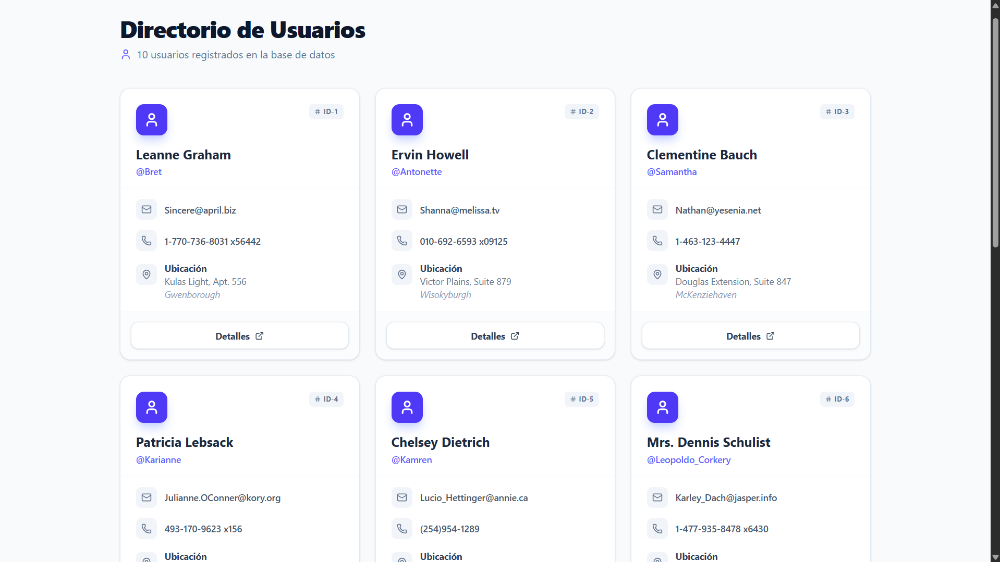

# 🚀 React + Vite – Consumo de API de Usuarios


Este proyecto es una aplicación web construida con **React** usando **Vite** que consume una API de usuarios y muestra información de forma dinámica y moderna.  

---

## 🖼 Captura de pantalla

<div align="center">
  
</div>

---

## 📌 ¿Qué es este template?

Este proyecto parte del template básico de **React + Vite**, con configuración mínima para funcionar con HMR y ESLint.  
Actualmente soporta:

- **@vitejs/plugin-react** – Fast Refresh con Babel  
- **@vitejs/plugin-react-swc** – Fast Refresh con SWC  

La plantilla no incluye React Compiler por defecto debido a impacto en performance.  
[Documentación React Compiler](https://react.dev/learn/react-compiler/installation)

---

## 🚀 Tecnologías utilizadas

- **React** – UI declarativa  
- **Vite** – Bundler rápido para desarrollo  
- **Fetch API / Axios** – Para consumir la API de usuarios  
- **React Hooks** – (`useState`, `useEffect`)  
- **CSS / Estilos propios**  

---

## 📦 Instalación

Clona el proyecto y ejecuta:

```bash
# Clonar el repositorio
git clone https://github.com/BALT9/react_consumo_api1.git

# Entrar en la carpeta del proyecto
cd react_consumo_api1

# Instalar dependencias
npm install

# Ejecutar en desarrollo
npm run dev